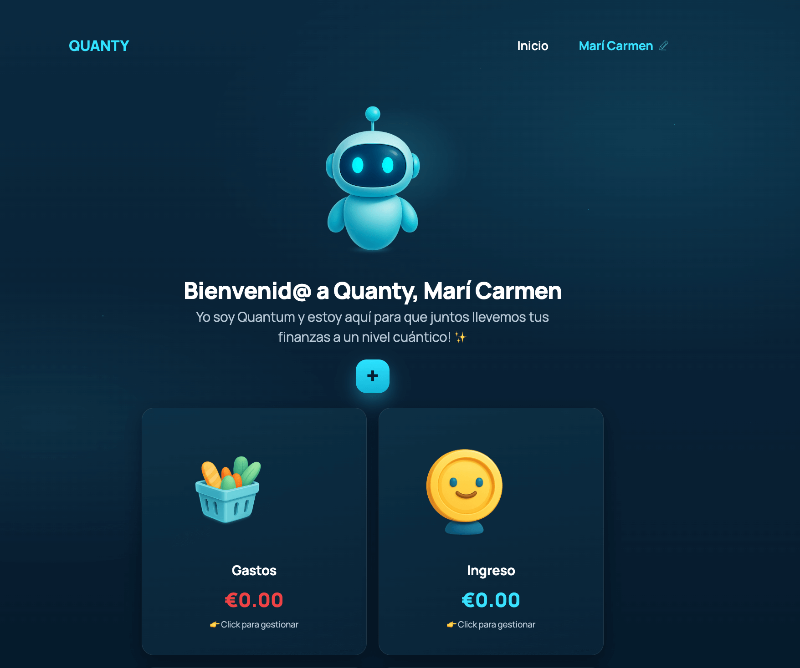
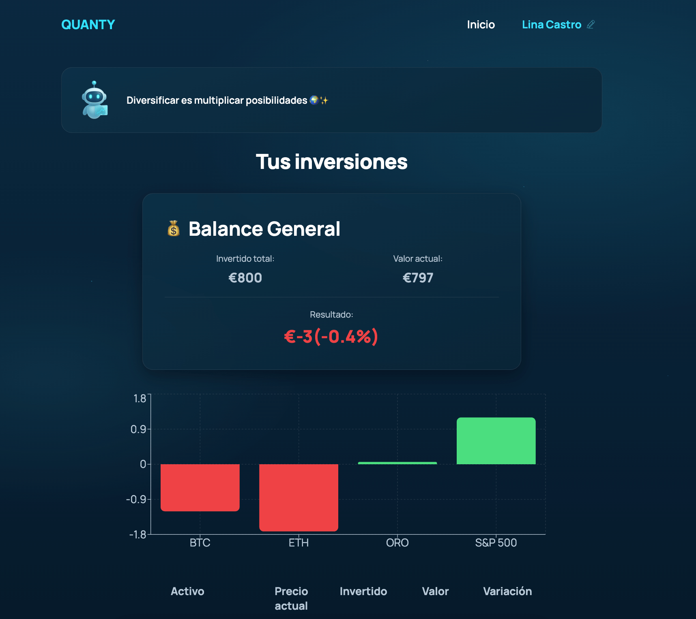
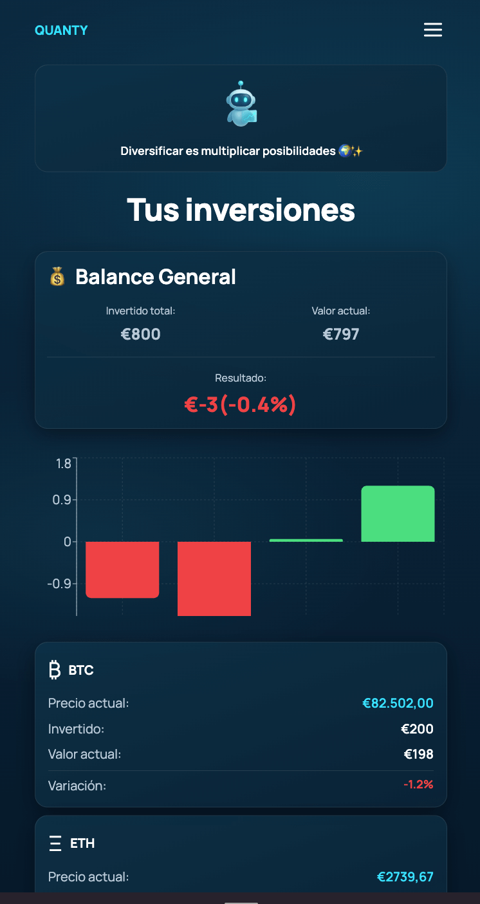
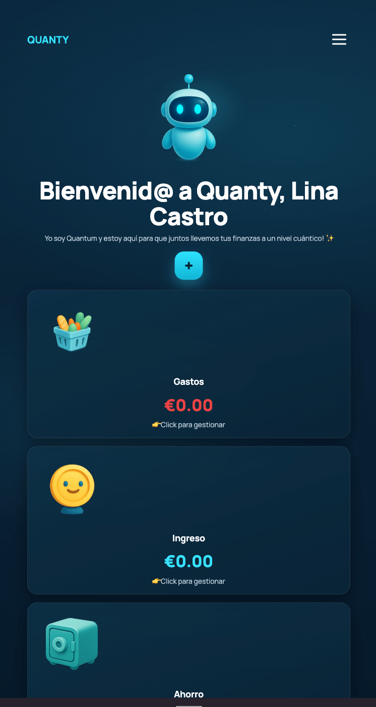

# Quanty - Aplicación de Finanzas Personales 💰

Aplicación web educativa de gestión financiera personal basada en el método japonés Kakeibo, con asistente virtual "Quantum" y visualización de inversiones en tiempo real.

---

## 🔗 Enlaces del Proyecto

- **Aplicación:** [https://quanty-frontend.vercel.app](https://quanty-frontend.vercel.app)
- **Repositorio Frontend:** [https://github.com/Lina079/quanty-frontend](https://github.com/Lina079/quanty-frontend)

---

## 📸 Capturas de Pantalla

### Dashboard Principal


### Gestión de Inversiones



### Personalización de Usuario


### Diseño Responsive


---

## 📋 Descripción

**Quanty** es una aplicación de educación financiera que ayuda a los usuarios a gestionar sus finanzas personales mediante el sistema de "4 cajas":

✅ **Ingresos** - Registro de entradas de dinero  
✅ **Gastos** - Control de egresos por categoría  
✅ **Ahorro** - Reserva de tranquilidad y metas  
✅ **Inversión** - Seguimiento de activos con precios en tiempo real  

La app incluye a **Quantum**, un asistente financiero que acompaña al usuario con mensajes contextuales de educación financiera.

---

## 🛠️ Tecnologías Utilizadas

### Frontend
- **React 18** - Framework principal
- **Vite** - Build tool y dev server
- **React Router v6** - Enrutamiento SPA
- **Recharts** - Gráficos interactivos
- **CSS Modules** - Estilos organizados con metodología BEM

### API Third-Party
- **CoinGecko API** - Precios en tiempo real de criptomonedas
  - Endpoint: `https://api.coingecko.com/api/v3`
  - Activos: Bitcoin, Ethereum, Oro (PAX Gold)
  - Sin autenticación requerida

### Deploy
- **Vercel** - Hosting y CI/CD automático

---

## ✨ Funcionalidades Principales

### Sistema de 4 Cajas
- Dashboard con resumen visual de todas las categorías
- Iconos personalizados para cada sección
- Navegación intuitiva entre módulos

### Gestión de Transacciones
- Agregar ingresos, gastos, ahorros e inversiones
- Categorías predefinidas y personalizables
- Persistencia en `localStorage`

### Inversiones en Tiempo Real
- Integración con CoinGecko API para precios actuales
- Tabla con 5 columnas: Activo, Precio Actual, Invertido, Valor, Variación
- Gráfica de barras con rendimiento por activo
- Diseño responsive con vista mobile optimizada

### Personalización
- Modal para editar nombre de usuario
- Validación de formularios
- Nombre persistente entre sesiones

### Quantum - Asistente Financiero
- Mensajes educativos contextuales
- Frases motivacionales sobre finanzas
- Imagen personalizada del bot

### Diseño Responsive
- Mobile-first approach
- Menú hamburguesa animado (3 barras → X)
- Adaptación completa desde 320px hasta desktop
- Gráficos y tablas optimizados para móvil

---

## 📂 Estructura del Proyecto
```
quanty-frontend/
├── src/
│   ├── blocks/              # CSS modular por componente
│   │   ├── button.css
│   │   ├── card.css
│   │   ├── footer.css
│   │   ├── header.css
│   │   ├── investments.css
│   │   ├── page.css
│   │   ├── popup.css
│   │   └── quantum.css
│   ├── components/          # Componentes React
│   │   ├── Dashboard.jsx
│   │   ├── Header.jsx
│   │   ├── Footer.jsx
│   │   ├── Gastos.jsx
│   │   ├── Ingresos.jsx
│   │   ├── Ahorros.jsx
│   │   ├── Inversiones.jsx
│   │   ├── Transacciones.jsx
│   │   ├── ModalEditarNombre.jsx
│   │   └── Popup.jsx
│   ├── images/              # Assets e imágenes
│   │   └── ImageReadme/     # Screenshots para README
│   ├── utils/               # Utilidades y APIs
│   │   ├── CoinGeckoApi.js
│   │   └── constants.js
│   ├── vendor/              # Recursos externos
│   │   └── fonts.css
│   ├── index.css            # CSS principal (imports)
│   ├── App.jsx              # Componente raíz
│   └── main.jsx             # Entry point
├── public/                  # Recursos públicos
├── vercel.json              # Configuración Vercel
└── package.json
```

---

## 🚀 Instalación y Ejecución Local

### Requisitos previos
- Node.js 18+
- npm o yarn

### Instalación
```bash
# Clonar repositorio
git clone https://github.com/Lina079/quanty-frontend.git
cd quanty-frontend

# Instalar dependencias
npm install

# Iniciar servidor de desarrollo
npm run dev
```

La aplicación estará disponible en `http://localhost:3000`

### Build para producción
```bash
npm run build
npm run preview
```

---

## 🔌 Integración CoinGecko API

### Endpoint utilizado
```
GET https://api.coingecko.com/api/v3/simple/price
```

### Parámetros
```javascript
{
  ids: 'bitcoin,ethereum,pax-gold',
  vs_currencies: 'eur',
  include_24hr_change: true
}
```

### Ejemplo de respuesta
```json
{
  "bitcoin": {
    "eur": 81590.00,
    "eur_24h_change": -3.7
  },
  "ethereum": {
    "eur": 2722.34,
    "eur_24h_change": -0.2
  },
  "pax-gold": {
    "eur": 3497.96,
    "eur_24h_change": -2.1
  }
}
```

### Implementación
Archivo: `src/utils/CoinGeckoApi.js`
```javascript
export const getCryptoPrices = async () => {
  const response = await fetch(
    `${API_BASE_URL}/simple/price?ids=bitcoin,ethereum,pax-gold&vs_currencies=eur&include_24hr_change=true`
  );
  const data = await response.json();
  return {
    bitcoin: {
      price: data.bitcoin.eur,
      change24h: data.bitcoin.eur_24h_change
    },
    // ...
  };
};
```

---

## 🎨 Metodología CSS

### Organización Modular
- **BEM (Block Element Modifier)** para nomenclatura
- Archivos CSS separados por bloque/componente
- Variables CSS para theming consistente
- Responsive con Mobile-First approach

### Variables CSS Principales
```css
:root {
  --bg-1: #061A2B;
  --bg-2: #0B2840;
  --cyan-accent: #38E1FF;
  --text-primary: #FFFFFF;
  --text-secondary: #B7C8D6;
}
```

---

## 📱 Responsive Design

### Breakpoints
- **Mobile:** 320px - 767px
- **Tablet:** 768px - 1024px
- **Desktop:** 1025px+

### Características Responsive
- Menú hamburguesa animado en móvil
- Tabla de inversiones con layout mobile (columnas → filas)
- Gráfica de barras con altura ajustada
- Grid de cards adaptativo
- Imágenes optimizadas por tamaño

---

## 🧪 Pruebas

### Probar la aplicación
1. Visita [https://quanty-frontend.vercel.app](https://quanty-frontend.vercel.app)
2. Explora el Dashboard
3. Navega a Inversiones para ver precios en tiempo real
4. Edita tu nombre de usuario
5. Prueba el responsive (320px - 1920px)

---

## 👩‍💻 Autora

**Lina Castro Rodriguez**  
*Full Stack Developer Jr. - Bootcamp TripleTen*

- 🔗 [LinkedIn](https://linkedin.com/in/lina-castro079)
- 💻 [GitHub](https://github.com/Lina079)
- 📧 linacastror079@gmail.com

---

## 📝 Notas del Proyecto

Este proyecto fue desarrollado como **Etapa 1 del Proyecto Final** del Bootcamp de Desarrollo Web de TripleTen.

### Características Destacadas
✅ Arquitectura frontend React profesional  
✅ Integración con API third-party (CoinGecko)  
✅ CSS modular con metodología BEM  
✅ Diseño responsive completo  
✅ HTML semántico (`<main>`, `<section>`)  
✅ Gestión de estado con React Hooks  
✅ Persistencia con localStorage  
✅ Deploy automático en Vercel  

### Próximos Pasos (Etapa 2 - Backend)
- API REST con Node.js + Express
- Base de datos MongoDB
- Autenticación JWT
- CRUD de transacciones real
- Sistema de usuarios

---

## 📄 Licencia

Este proyecto es parte de un bootcamp educativo. El código está disponible con fines de portafolio y aprendizaje.

---

**Versión:** 1.0.0 (Etapa 1 - Frontend)
**Proyecto presentado para revisión** Etapa 1 - Frontend  
**Última actualización:** Noviembre 2025