# Quanty - Aplicación de Finanzas Personales 💰

Aplicación web full-stack de gestión financiera personal basada en el método japonés Kakeibo, con asistente virtual "Quantum", autenticación segura y visualización de inversiones en tiempo real.

---

## 🔗 Enlaces del Proyecto

| Recurso | URL |
|---------|-----|
| **Aplicación** | [https://myquanty.com](https://myquanty.com) |
| **API Backend** | [https://api.myquanty.com](https://api.myquanty.com) |
| **Repositorio Frontend** | [https://github.com/Lina079/quanty-frontend](https://github.com/Lina079/quanty-frontend) |
| **Repositorio Backend** | [https://github.com/Lina079/quanty-backend](https://github.com/Lina079/quanty-backend) |

---

## 📸 Capturas de Pantalla

### Autenticación
| Login (Tema Claro) | Registro (Tema Oscuro) |
|:------------------:|:----------------------:|
| 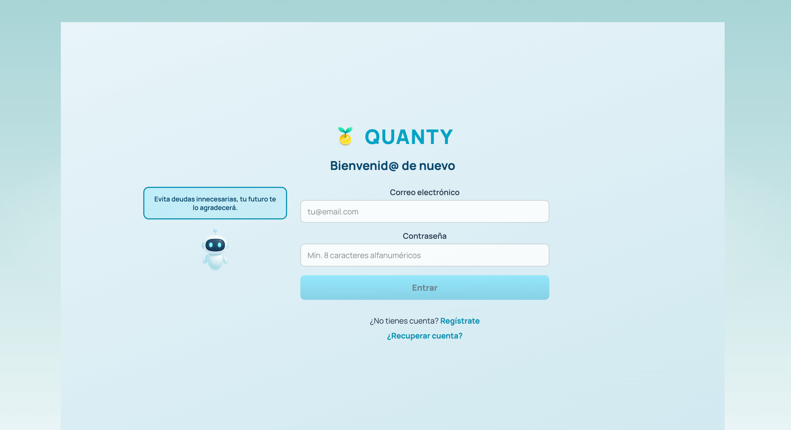 | 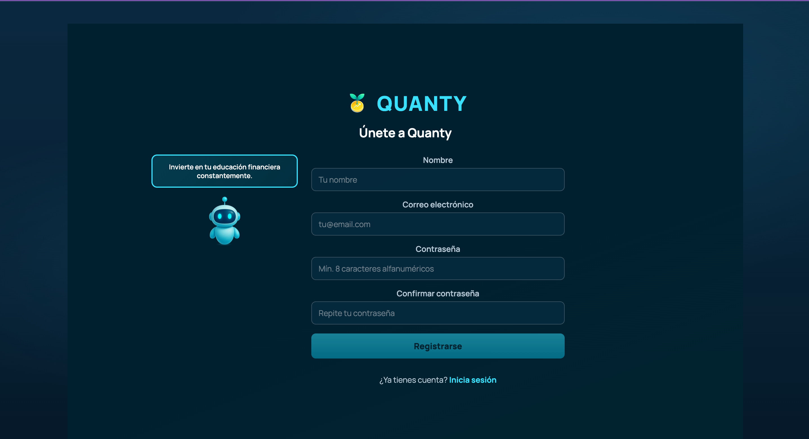 |

### Dashboard Principal
| Tema Oscuro | Tema Claro |
|:-----------:|:----------:|
| 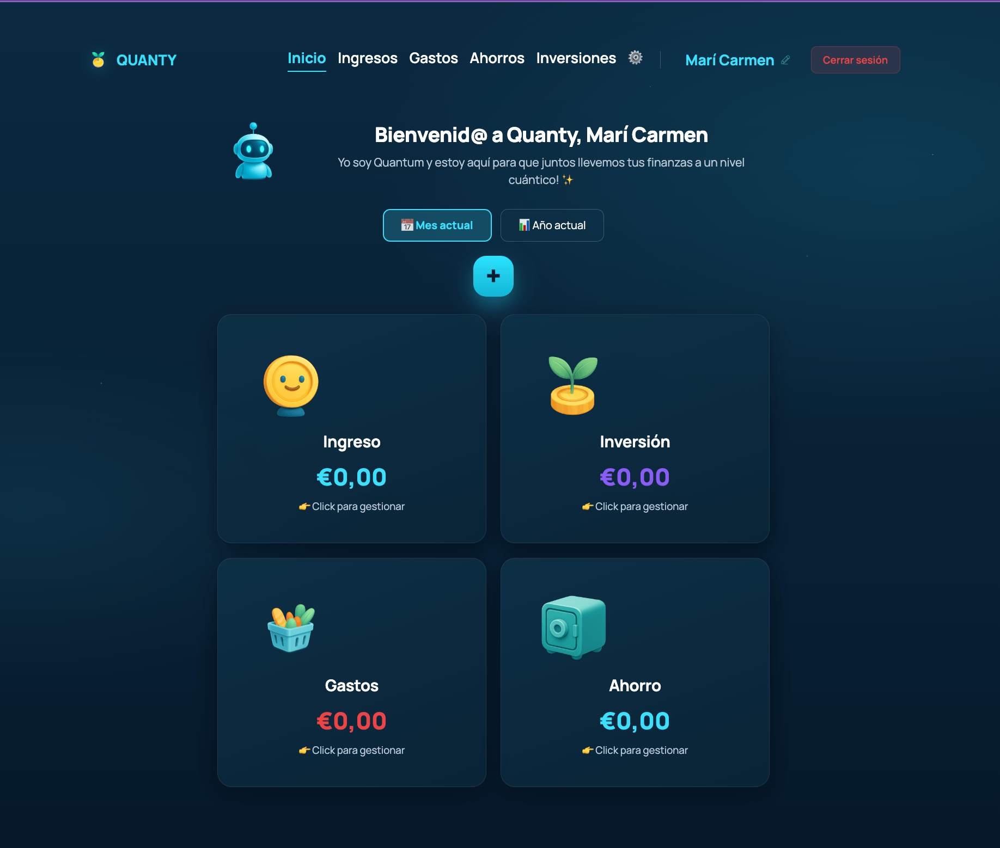 | 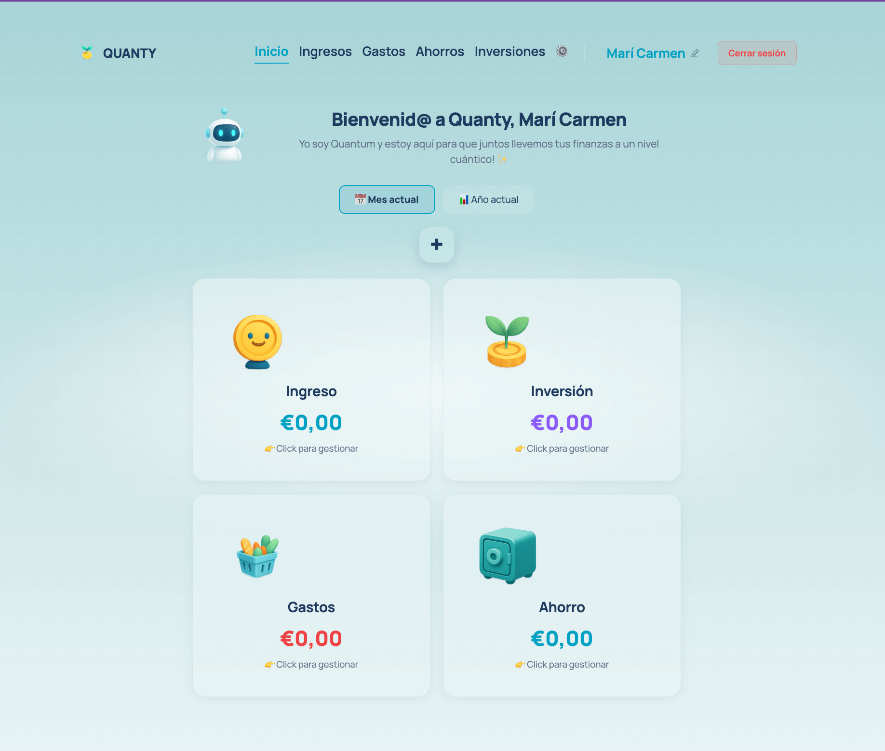 |

### Panorama Financiero
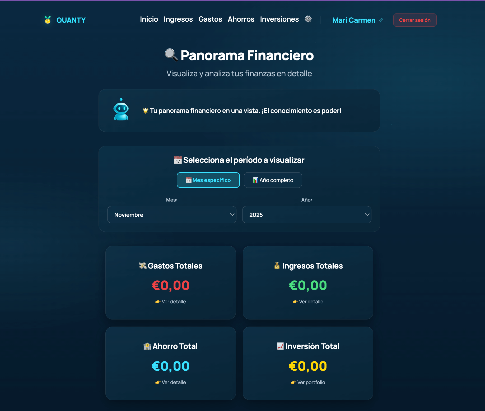

### Análisis por Categoría
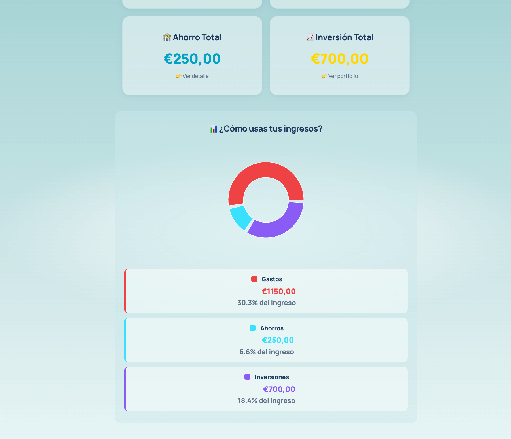

### Gestión de Inversiones
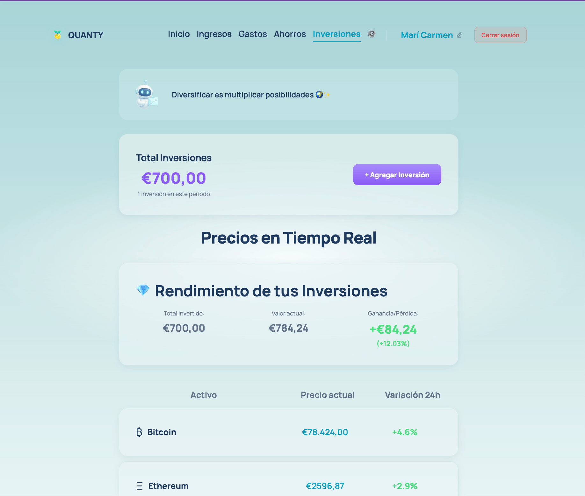

### Configuración de Usuario
| Selección de Moneda | Selección de Tema | Selección de Idioma |
|:-------------------:|:-----------------:|:-------------------:|
| 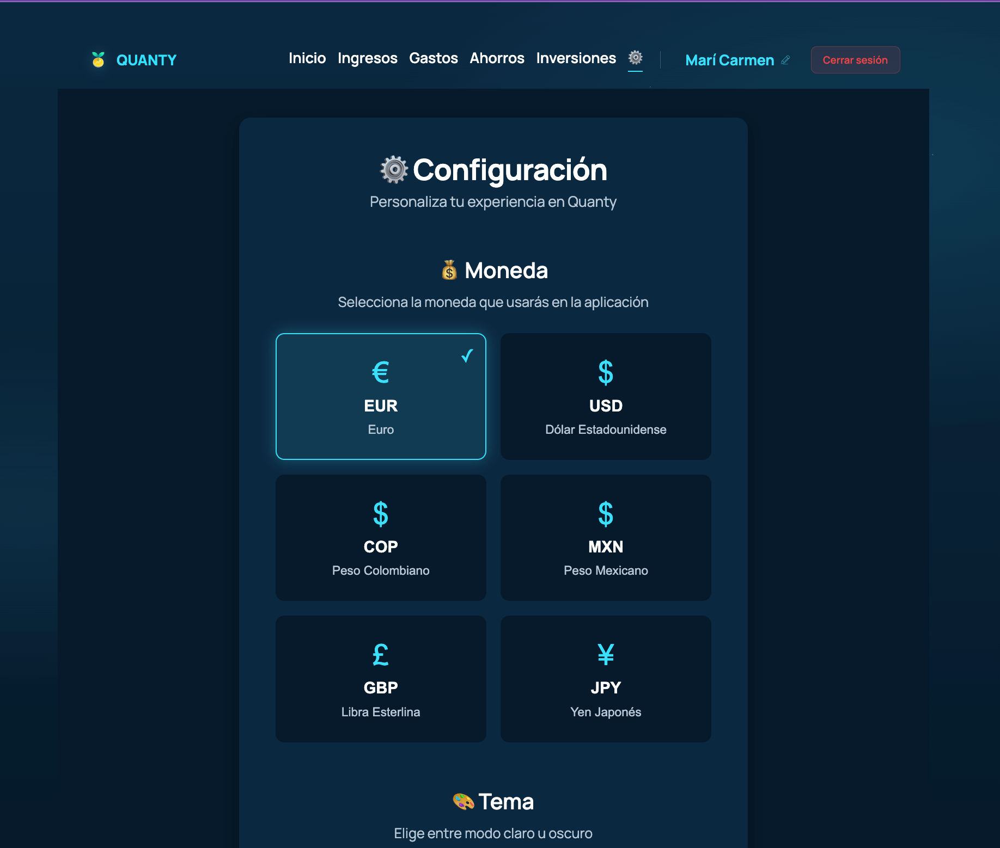 | 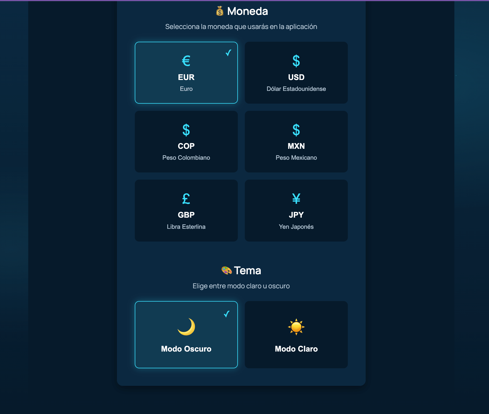 | 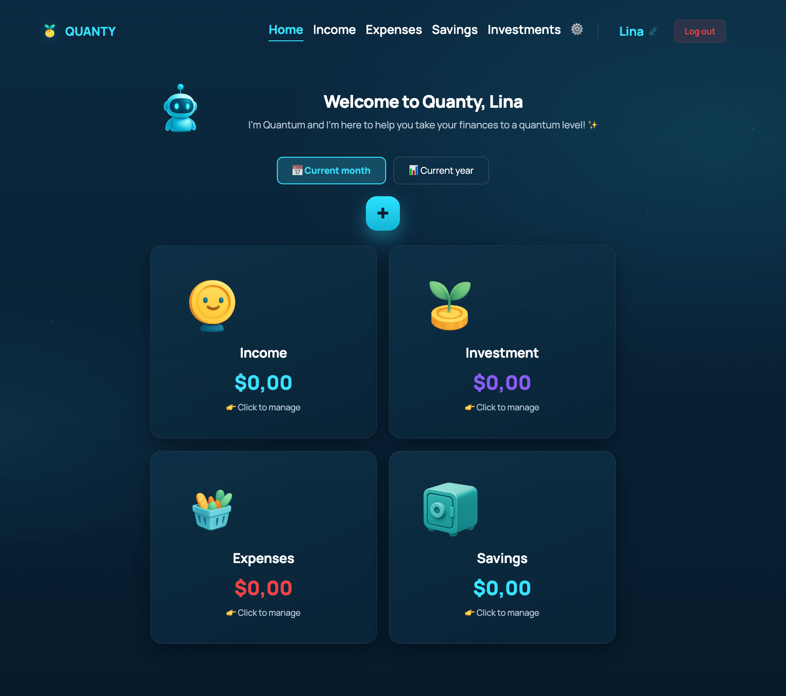 (./src/images/ImageReadme/English-version.png) |

### Diseño Responsive
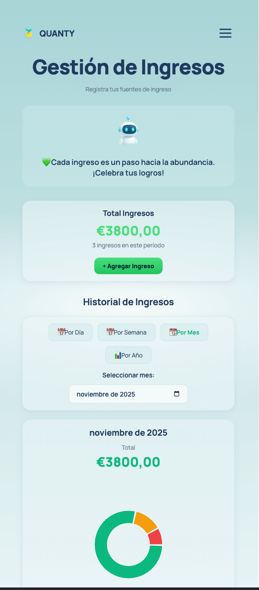

---

## 📋 Descripción

**Quanty** es una aplicación full-stack de educación financiera que ayuda a los usuarios a gestionar sus finanzas personales mediante el sistema de "4 cajas":

| Caja | Descripción |
|------|-------------|
| 💰 **Ingresos** | Registro de entradas de dinero |
| 💸 **Gastos** | Control de egresos por categoría |
| 🏦 **Ahorro** | Reserva de tranquilidad y metas |
| 📈 **Inversión** | Seguimiento de activos con precios en tiempo real |

La app incluye a **Quantum**, un asistente financiero virtual que acompaña al usuario con mensajes contextuales de educación financiera.

---

## 🛠️ Tecnologías Utilizadas

### Frontend
| Tecnología | Uso |
|------------|-----|
| React 18 | Framework principal |
| Vite | Build tool y dev server |
| React Router v6 | Enrutamiento SPA |
| Recharts | Gráficos interactivos |
| CSS Modules | Estilos con metodología BEM |

### Backend
| Tecnología | Uso |
|------------|-----|
| Node.js | Runtime |
| Express | Framework web |
| MongoDB Atlas | Base de datos |
| Mongoose | ODM |
| JWT | Autenticación |
| bcrypt | Encriptación de contraseñas |

### APIs Externas
| API | Uso |
|-----|-----|
| CoinGecko | Precios de criptomonedas en tiempo real |

### Infraestructura
| Servicio | Uso |
|----------|-----|
| Google Cloud Run | Hosting del backend |
| Vercel | Hosting del frontend |
| Cloudflare | DNS y certificados SSL |

---

## ✨ Funcionalidades Principales

### 🔐 Autenticación Segura
- Registro con validación de datos
- Login con JWT
- Rutas protegidas
- Persistencia de sesión

### 📊 Sistema de 4 Cajas
- Dashboard con resumen visual
- Filtrado por mes o año
- Gráficas de distribución (dona)
- Historial de transacciones

### 💱 Multi-Moneda
- Euro (€)
- Dólar estadounidense ($)
- Peso colombiano ($)
- Peso mexicano ($)
- Libra esterlina (£)
- Yen japonés (¥)

### 🎨 Temas Visuales
- Modo oscuro (por defecto)
- Modo claro
- Persistencia de preferencia

### 🌐 Internacionalización (i18n)
- Español (por defecto)
- English
- Persistencia de preferencia de idioma
- Traducciones completas de interfaz

### 📈 Inversiones en Tiempo Real
- Precios actualizados via CoinGecko API
- Bitcoin, Ethereum, Oro (PAX Gold)
- Cálculo de variación 24h
- Vista responsive optimizada

### 🤖 Quantum - Asistente Financiero
- Mensajes educativos contextuales
- Imágenes adaptadas al tema
- Acompañamiento en cada sección

---

## 📂 Estructura del Proyecto
```
quanty-frontend/
├── src/
│   ├── components/
│   │   ├── Auth/                    # Login y Register
│   │   ├── Dashboard.jsx            # Página principal
│   │   ├── Footer/
│   │   ├── Header/
│   │   ├── Main/
│   │   │   ├── Ahorros.jsx
│   │   │   ├── Gastos.jsx
│   │   │   ├── Ingresos.jsx
│   │   │   ├── Inversiones.jsx
│   │   │   ├── Transacciones.jsx
│   │   │   └── components/
│   │   │       ├── CardResumen.jsx
│   │   │       ├── HistorialFiltrado.jsx
│   │   │       └── ModalConfirmacion.jsx
│   │   ├── ProtectedRoute.jsx       # Protección de rutas
│   │   ├── Toast/                   # Notificaciones
│   │   └── UserSettings/            # Configuración usuario
│   ├── contexts/
│   │   ├── CurrentUserContext.jsx   # Estado del usuario
│   │   ├── LanguageContext.jsx      # Idioma de la app
│   │   ├── SettingsContext.jsx      # Moneda y tema
│   │   ├── ToastContext.jsx         # Notificaciones
│   │   └── TransactionsContext.jsx  # CRUD transacciones
│   ├── i18n/                        # Sistema de traducciones
│   │   ├── es.json                  # Español
│   │   ├── en.json                  # English
│   │   └── index.js                 # Lógica de traducción
│   ├── blocks/                      # CSS modular (BEM)
│   ├── images/
│   │   └── ImageReadme/             # Screenshots
│   ├── utils/                       # APIs y helpers
│   └── vendor/                      # Fuentes
├── index.html
├── vite.config.js
├── vercel.json
└── package.json
```
---

## 🚀 Instalación y Ejecución Local

### Requisitos previos
- Node.js 18+
- npm o yarn

### Instalación
```bash
# Clonar repositorio
git clone https://github.com/Lina079/quanty-frontend.git
cd quanty-frontend

# Instalar dependencias
npm install

# Iniciar servidor de desarrollo
npm run dev
```

La aplicación estará disponible en `http://localhost:3000`

### Variables de Entorno

Crea un archivo `.env` en la raíz:
```env
VITE_API_URL=https://api.myquanty.com
```

### Build para producción
```bash
npm run build
npm run preview
```

---

## 🔌 Integración con Backend

### Endpoints Principales

| Método | Endpoint | Descripción |
|--------|----------|-------------|
| POST | `/signup` | Registro de usuario |
| POST | `/signin` | Inicio de sesión |
| GET | `/users/me` | Obtener perfil |
| PATCH | `/users/me` | Actualizar perfil |
| GET | `/transactions` | Listar transacciones |
| POST | `/transactions` | Crear transacción |
| DELETE | `/transactions/:id` | Eliminar transacción |

### Autenticación

Todas las rutas (excepto `/signup` y `/signin`) requieren el header:
```
Authorization: Bearer <JWT_TOKEN>
```

---

## 🔌 Integración CoinGecko API

### Endpoint
```
GET https://api.coingecko.com/api/v3/simple/price
```

### Parámetros
```javascript
{
  ids: 'bitcoin,ethereum,pax-gold',
  vs_currencies: 'eur',
  include_24hr_change: true
}
```

---

## 📱 Responsive Design

### Breakpoints

| Dispositivo | Rango |
|-------------|-------|
| Mobile | 320px - 767px |
| Tablet | 768px - 1024px |
| Desktop | 1025px+ |

### Características

- Mobile-first approach
- Menú hamburguesa animado
- Tablas adaptativas
- Gráficas responsivas
- Fuentes con `clamp()` para escalado fluido

---

## 👩‍💻 Autora

**Lina Castro Rodriguez**  
*Full Stack Developer Jr. - Bootcamp TripleTen*

| Contacto | Enlace |
|----------|--------|
| LinkedIn | [linkedin.com/in/lina-castro079](https://linkedin.com/in/lina-castro079) |
| GitHub | [github.com/Lina079](https://github.com/Lina079) |
| Email | linacastror079@gmail.com |

---

## 📝 Notas del Proyecto

Este proyecto fue desarrollado como **Proyecto Final** del Bootcamp de Desarrollo Web de TripleTen.

### Criterios Cumplidos

**Frontend (React + Auth):**
- ✅ Componentes funcionales con Hooks
- ✅ React Context para estado global
- ✅ Rutas protegidas con ProtectedRoute
- ✅ Autenticación JWT completa
- ✅ Diseño responsive
- ✅ Fetch API (sin axios)

**Backend (Node + Express + MongoDB):**
- ✅ API RESTful completa
- ✅ Autenticación con JWT
- ✅ Validación con Joi/Celebrate
- ✅ Contraseñas hasheadas con bcrypt
- ✅ Manejo centralizado de errores
- ✅ Logging con Winston
- ✅ Deploy en Google Cloud Run

---

## 📄 Licencia

Proyecto educativo desarrollado para el Bootcamp TripleTen. Código disponible con fines de portafolio y aprendizaje.

---

**Versión:** 2.1.0 (Full-Stack + i18n)  
**Última actualización:** Noviembre 2025